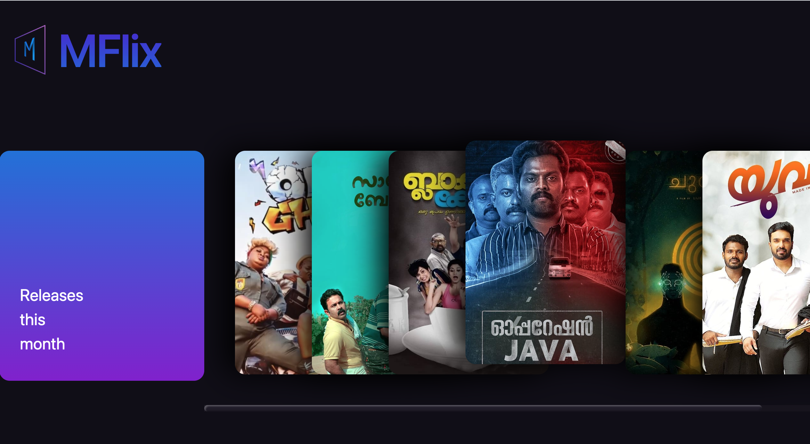
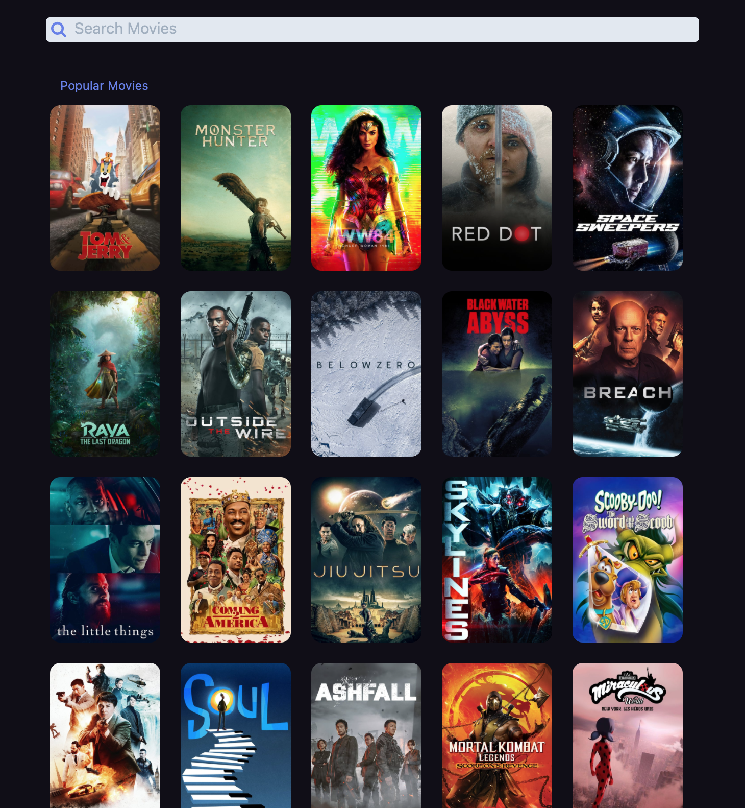
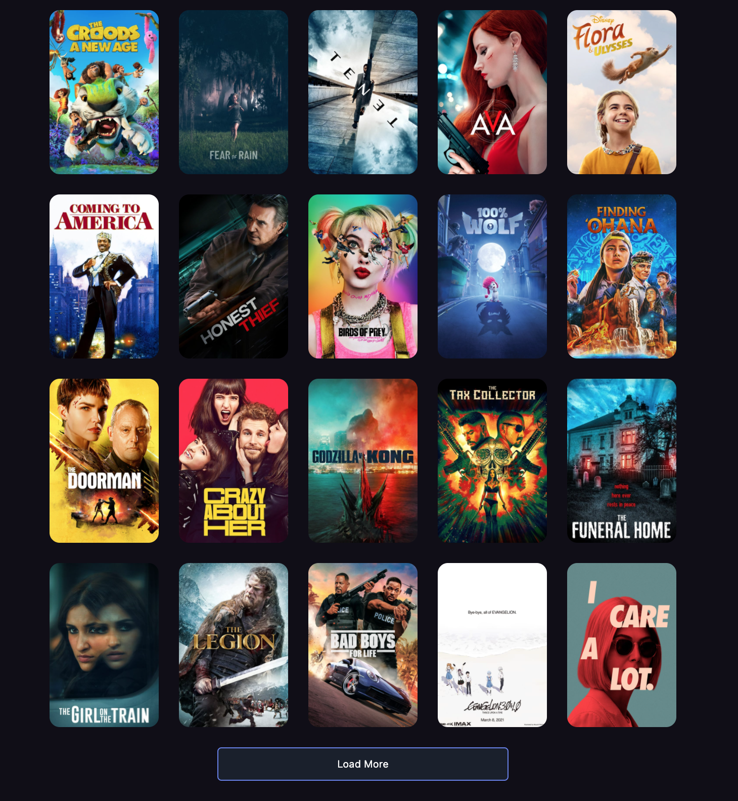
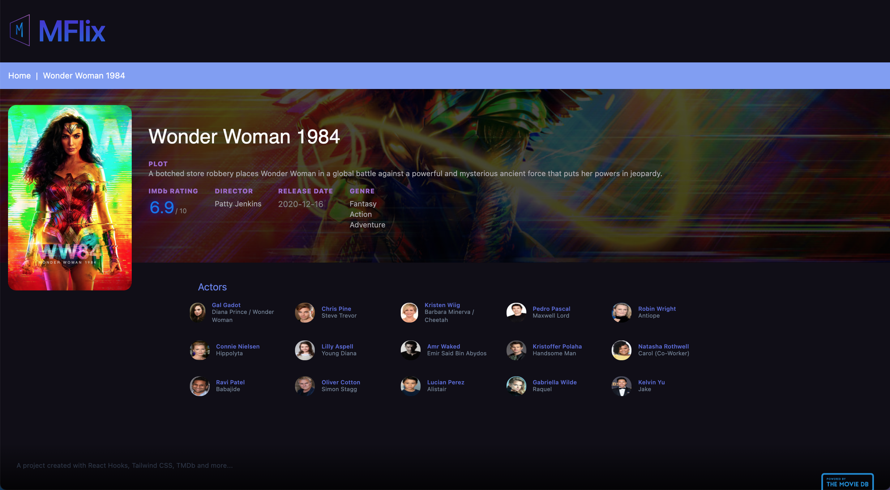

# Project [MFlix](https://movies.abykal.me/): New Movies Releases

## This side project was based on React Hooks, styled using [Tailwind CSS](https://tailwindcss.com/) with REST API data from [TMDb](https://www.themoviedb.org/).

## In the project directory, you can run:

### `npm install`

### `npm start`

---

---
